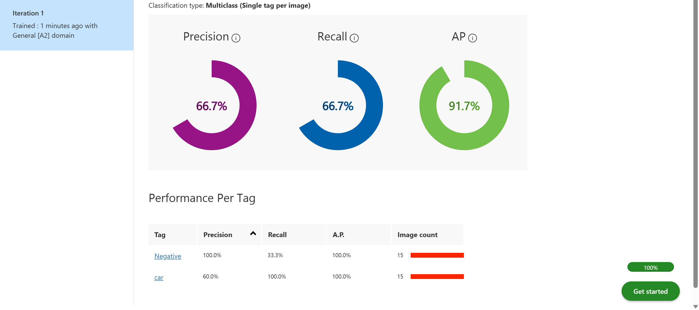
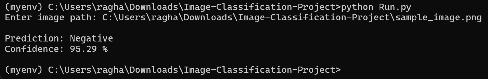

# Image-Classification-ONNX

Car Image Classification using Microsoft Azure Custom Vision and ONNX Runtime.

---

# Overview

This project demonstrates a simple image classification model built using **Microsoft Azure Custom Vision**. The objective is to classify whether an image contains a **car** or **does not contain a car**.

After training, the model was exported in **ONNX** format, allowing it to run locally on different operating systems using Python.

---

# Project Goal

Develop a basic image classification model while learning the complete Azure Custom Vision workflow, including:

- Data collection
- Data labeling
- Model training
- Performance evaluation
- Model export
- Local inference using ONNX

---

# Dataset

A public dataset was not used.

Instead, a small custom dataset was manually collected containing:

- 15 images of cars
- 15 images of non-car objects

This limited dataset was intentionally created as a learning project to understand the complete machine learning workflow from start to finish.

---

# Technologies Used

- Microsoft Azure Custom Vision
- Python
- ONNX Runtime
- ONNX Model Format

---

# Project Workflow

1. Created an Azure Custom Vision resource.
2. Created a new Image Classification project.
3. Collected and labeled the dataset manually.
4. Trained the model using Azure Custom Vision.
5. Evaluated the model using Azure metrics.
6. Exported the trained model as an ONNX model.
7. Executed the exported model locally using Python.

---

# Results

Due to the small training dataset, the model achieved relatively low **Precision** and **Recall** scores, which was expected.

However, the **Average Precision (AP)** demonstrated that the model was able to distinguish between the two classes within the available dataset.

Increasing both the dataset size and image diversity would significantly improve the model's accuracy and generalization.

---

# Repository Structure

- `model.onnx` — Exported ONNX model.
- `Run.py` — Python inference script.
- `requirements.txt` — Required Python packages.
- `labels.txt` — Class labels.
- `sample_image.png` — Example image for testing.
- `screenshots/` — Azure training results and local inference screenshots.

---

# Inference Workflow

The `Run.py` script performs the following steps:

1. Load the exported ONNX model.
2. Prompt the user to enter an image path.
3. Read the input image.
4. Verify that the image exists.
5. Convert the image from **BGR** to **RGB**.
6. Resize the image to **224 × 224** pixels.
7. Normalize pixel values to the range **0–1**.
8. Rearrange the image dimensions to match the model input format.
9. Add a batch dimension for inference.
10. Run inference using ONNX Runtime.
11. Retrieve the predicted class and confidence score.
12. Display the final prediction.

---

# Screenshots

The following screenshots demonstrate both the Azure Custom Vision training results and the exported ONNX model running locally.

### Azure Custom Vision Results

### Python Inference

---

# Future Improvements

- Increase the dataset size.
- Add more diverse images.
- Improve Precision and Recall.
- Compare the ONNX model with TensorFlow deployment.
- Deploy the model as a cloud service or web API.

---

# What I Learned

Through this project, I gained practical experience with:

- Azure Custom Vision
- Image classification workflow
- Data collection and labeling
- Model evaluation
- ONNX model export
- Running AI models locally using Python
- Understanding how dataset size affects model performance
